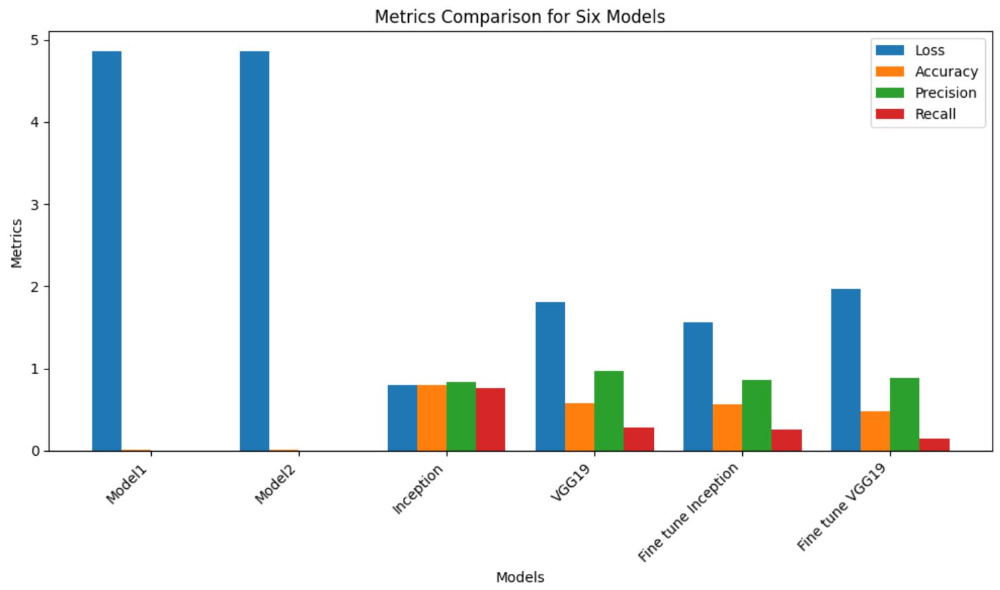

# FruitDetect: Machine Learning for Fruit Identification
  

## Table of Contents
- [Project Description](#project-description)
- [Project Structure](#project-structure)
    - [1. Data Preparation](#1-data-preparation)
    - [2. Model Development](#2-model-development)
        - [Model 1: Dense Layers](#model-1-dense-layers)
        - [Model 2: Convolutional Neural Network (CNN)](#model-2-convolutional-neural-network-cnn)
    - [3. Transfer Learning](#3-transfer-learning)
        - [Transfer Learning Model 1: InceptionNet](#transfer-learning-model-1-inceptionnet)
        - [Transfer Learning Model 2: VGG19](#transfer-learning-model-2-vgg19)
    - [4. Fine-Tuned Transfer Learning](#4-fine-tuned-transfer-learning)
        - [Fine-Tuned Inception Model](#fine-tuned-inception-model)
        - [Fine-Tuned VGG19 Model](#fine-tuned-vgg19-model)
    - [5. Model Evaluation](#5-model-evaluation)
    - [6. Metrics Comparison](#6-metrics-comparison)
- [Usage](#usage)
- [Results](#results)
- [License](#license)

## Project Description

The "FruitDetect: Machine Learning for Fruit Identification" project is a comprehensive effort to leverage the capabilities of neural networks for the challenging task of classifying 131 distinct fruit varieties based on their images. Identifying and categorizing fruits manually can be a daunting challenge due to the immense diversity in shape, size, color, and texture across different fruit types. The neural networks employed in this project possess the capability to learn intricate patterns and features from input fruit images, enabling them to make highly accurate predictions regarding the fruit's class. Through the power of convolutional neural networks (CNNs) and deep learning techniques, we have fine-tuned our models to recognize not only the most common fruits but also rare and exotic varieties.

## Project Structure

The project is structured into several key components, including data preparation, model development, training, and evaluation. Below is an outline of each major section:

### 1. Data Preparation

- The project utilizes a dataset of fruit images, which can be obtained from [Kaggle](https://www.kaggle.com/datasets/moltean/fruits). The dataset includes two main folders:
  - **Train**: Contains subfolders labeled with the names of various fruits and vegetables, each containing images of the respective fruit/vegetable. This folder is used for training purposes.
  - **Test**: Similar to the train folder, it contains subfolders with test images for evaluation.

### 2. Model Development

#### Model 1: Dense Layers

- Architecture: This model consists of two dense layers.
- Optimizer: Adam optimizer with a learning rate of 0.01.
- Loss Function: Categorical CrossEntropy.
- Number of Epochs: 10.
- Validation Data: A validation dataset is used for monitoring model performance during training.

#### Model 2: Convolutional Neural Network (CNN)

- Architecture: This model includes convolutional layers, max-pooling layers, and dense layers with ReLU activation.
- Optimizer: Adam optimizer with a learning rate of 0.001.
- Loss Function: Categorical CrossEntropy.
- Number of Epochs: 5.
- Validation Data: A validation dataset is used for monitoring model performance during training.

### 3. Transfer Learning

#### Transfer Learning Model 1: InceptionNet

- Architecture: Utilizes the InceptionV3 model with pre-trained weights and a global average pooling layer followed by a dense layer with softmax activation for classification.
- Optimizer: Adam optimizer.
- Loss Function: Categorical CrossEntropy.
- Number of Epochs: 5.
- Validation Data: A validation dataset is used for monitoring model performance during training.

#### Transfer Learning Model 2: VGG19

- Architecture: Utilizes the VGG19 model with pre-trained weights and a global average pooling layer followed by a dense layer with softmax activation for classification.
- Optimizer: Adam optimizer.
- Loss Function: Categorical CrossEntropy.
- Number of Epochs: 5.
- Validation Data: A validation dataset is used for monitoring model performance during training.

### 4. Fine-Tuned Transfer Learning

#### Fine-Tuned Inception Model

- Architecture: Extends the pre-trained InceptionV3 model with additional convolutional and dense layers for fine-tuning to the specific dataset.
- Optimizer: Adam optimizer.
- Loss Function: Categorical CrossEntropy.
- Number of Epochs: 5.
- Validation Data: A validation dataset is used for monitoring model performance during training.

#### Fine-Tuned VGG19 Model

- Architecture: Extends the pre-trained VGG19 model with additional convolutional and dense layers for fine-tuning to the specific dataset.
- Optimizer: Adam optimizer.
- Loss Function: Categorical CrossEntropy.
- Number of Epochs: 5.
- Validation Data: A validation dataset is used for monitoring model performance during training.

### 5. Model Evaluation

- All models are evaluated on a test dataset, and metrics such as loss, accuracy, precision, and recall are reported for each model.

### 6. Metrics Comparison

- A comparison of the metrics (loss, accuracy, precision, recall) for all six models is presented in a visual format.

## Usage

To replicate or modify this project, follow these steps:

1. Obtain the fruit dataset from [Kaggle](https://www.kaggle.com/datasets/moltean/fruits).
2. Set up the necessary environment, including installing the required libraries and frameworks (TensorFlow, matplotlib, etc.).
3. Use Jupyter Notebook or a similar environment to execute the provided code blocks.
4. Adjust hyperparameters, model architectures, and training settings as needed.
5. Evaluate model performance on your test dataset.

Feel free to explore different models, hyperparameters, and preprocessing techniques to enhance the accuracy of fruit classification.

## Results

The project includes a visualization of the metrics for each model, allowing you to compare their performance. Make sure to analyze the results carefully to determine which model best suits your specific fruit classification task.  

## License

This project is licensed under the [MIT License](LICENSE.md). Feel free to use, modify, and distribute the code as needed, but please provide proper attribution.
